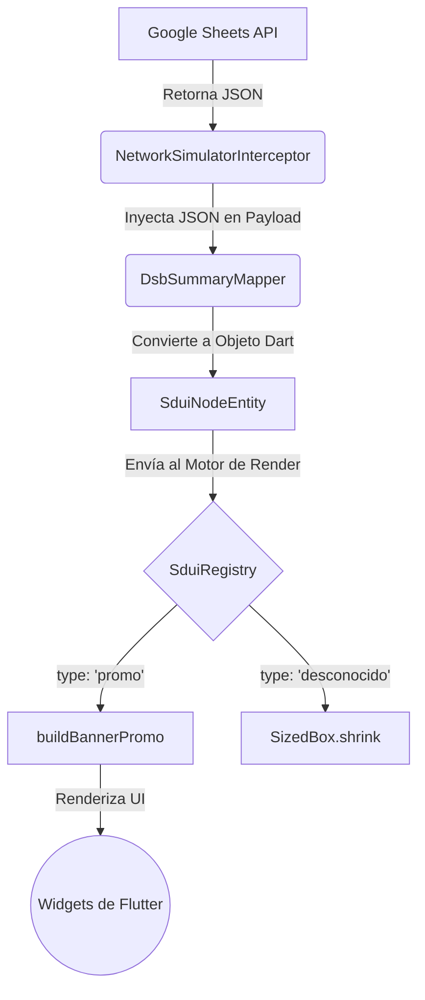

# Documentación de Arquitectura y Decisiones Técnicas (ADR) - Fintech Core

A continuación se detallan las decisiones arquitectónicas clave tomadas durante el desarrollo de la aplicación financiera, siguiendo el formato estándar de *Architecture Decision Records* (ADR).

## 1. Patrón Arquitectónico Principal
- **Problema a resolver:** Se requería una arquitectura limpia, escalable y mantenible para una app financiera, que soporte la división del trabajo en equipos (squads) sin caer en la sobreingeniería o "verbosidad" excesiva.
- **Alternativas evaluadas:** 
  - *Layer-First (MVC/MVVM clásico):* Agrupar por capas lógicas (todos los modelos juntos, todos los blocs juntos).
  - *Clean Architecture Clásica:* Uso riguroso de Casos de Uso (Use Cases) e interfaces abstractas para cada interacción.
- **Opción seleccionada:** *Pragmatic Clean Architecture (Feature-First)*. Agrupación física por funcionalidades (`features`), eliminando la capa redundante de *Casos de Uso* y comunicando directamente el BLoC con el Repositorio.

**Estructura Gráfica de un Feature:**
```text
lib/features/dashboard/
├── data/
│   ├── datasources/
│   │   ├── dsb_local_store.dart
│   │   └── dsb_network_data_source.dart
│   ├── mappers/
│   │   └── dsb_summary_mapper.dart
│   └── models/
│       └── dsb_summary_model.dart
├── domain/
│   ├── entities/
│   │   └── dsb_summary_entity.dart
│   └── repositories/
│       ├── interfaces/dsb_i_repository.dart
│       └── dsb_repository.dart
├── presentation/
│   ├── bloc/
│   │   ├── dsb_summary_bloc.dart
│   │   └── dsb_summary_params.dart
│   ├── pages/
│   │   └── dsb_dashboard_page.dart
└── dsb_injector.dart
```

- **Trade-offs:** Se sacrifica la pureza teórica estricta de Clean Architecture (al no tener interactors aislados) a cambio de una altísima velocidad de desarrollo y menor *boilerplate*.
- **Impacto a largo plazo:** Permite escalar fácilmente hacia arquitecturas de Micro-Frontends. Cada "feature" puede aislarse y empaquetarse en un submódulo independiente sin romper el resto de la app, facilitando el trabajo paralelo de cientos de desarrolladores.

## 2. Gestión de Estado y Flujo de Datos UI
- **Problema a resolver:** El manejo repetitivo de estados de red (Loading, Success, Error, Empty) en cada pantalla genera código espagueti y componentes acoplados que son difíciles de probar unitariamente.
- **Alternativas evaluadas:**
  - *Cubit genéricos:* Simples pero menos rastreables para sistemas de analítica y logs.
  - *Estados y Eventos manuales por Feature:* Escribir `LoginLoading`, `LoginSuccess`, `DashboardLoading`, `DashboardError`, etc. de forma repetitiva.
- **Opción seleccionada:** *BaseDataBloc y BaseAsyncValueState genéricos*. Se creó un núcleo genérico asíncrono. Todos los features extienden esta base, heredando nativamente los estados y las transiciones lógicas sin necesidad de reescribir código.
- **Trade-offs:** Existe una ligera curva de aprendizaje inicial para que los nuevos desarrolladores entiendan el uso de genéricos (`<T>`) en Dart, pero una vez asimilado, el ahorro de código es masivo.
- **Impacto a largo plazo:** Estandariza la experiencia de usuario (UX). Al haber un solo motor de estados, si en el futuro se decide cambiar la forma en que se muestran los "Loadings" o los "Snackbars de Error", se modifica un solo archivo Core y afecta a toda la aplicación de inmediato.

## 3. Resiliencia, Red y Manejo de Errores (Degraded Network)
- **Problema a resolver:** Las aplicaciones financieras deben ser robustas ante condiciones de red intermitentes, caídas de microservicios o alta latencia, sin mostrar pantallas congeladas o errores técnicos (ej. *SocketException*) al usuario final.
- **Alternativas evaluadas:**
  - *Validación en cada endpoint:* Manejar `try-catch` y lógicas de reintento de forma manual en cada llamada HTTP.
  - *Cacheo manual:* Guardar la data en memoria local directamente desde la vista.
- **Opción seleccionada:** *NetworkHandler Mixin, Interceptor de Simulación y Caché Offline-First (Hive)*. 
  Toda petición HTTP es filtrada por un interceptor inteligente. Si la red falla de verdad (o por la simulación aleatoria de estrés que creamos), el mixin atrapa el error de `Dio` y el Repositorio recupera automáticamente la información almacenada en `Hive` silenciosamente.
- **Trade-offs:** La estrategia Offline-First exige una cuidadosa sincronización (invalidación de caché en el futuro) para asegurar que no se muestren balances o saldos financieros desactualizados de forma permanente.
- **Impacto a largo plazo:** Garantiza una altísima disponibilidad percibida. El usuario siempre verá una interfaz funcional y su saldo reciente, aumentando la confianza en el banco incluso en condiciones de movilidad extrema (ej. en el metro o ascensores).

## 4. Server Driven UI (SDUI) Dinámico
- **Problema a resolver:** El banco necesita desplegar promociones o alertas críticas (Banners) dinámicamente en el Dashboard sin tener que pasar por el lento proceso de revisión y publicación de las tiendas (App Store / Play Store).
- **Alternativas evaluadas:**
  - *Firebase Remote Config:* Excelente para variables simples, pero limita el dinamismo a estructuras pre-definidas y no a componentes UI enteros.
  - *Librerías completas de SDUI:* Como `mirai` o `json_dynamic_widget`. Muy pesadas, dependientes de terceros y con exceso de funcionalidades.
- **Opción seleccionada:** *Motor SDUI propio + API Serverless (Google Apps Script)*. Se creó un `SduiRegistry` que mapea JSONs ligeros a componentes nativos de Flutter. Como backend rápido para el MVP, se integró una hoja de cálculo de Google Sheets que actúa como API REST para modificar el diseño desde la nube en tiempo real.

**Flujo de Server Driven UI:**


- **Trade-offs:** El motor propio inicial solo cubre los widgets estrictamente necesarios (Text, Container, Banner). Además, usar Google Sheets es una solución creativa temporal para validación rápida (MVP), pero requerirá migración a un backend formal (AWS/Azure) antes de ir a producción masiva.
- **Impacto a largo plazo:** Desacopla la vista de la lógica dura. En el futuro, el equipo de marketing o producto puede construir promociones y pantallas desde un CMS propietario sin requerir el despliegue de los desarrolladores móviles.

## 5. Inyección de Dependencias Modular
- **Problema a resolver:** Evitar el patrón Singleton global (un antipatrón en Flutter moderno) para Repositorios y Datasources, asegurando que el ciclo de vida de los datos viva y muera junto a la interfaz (Contexto).
- **Alternativas evaluadas:**
  - *get_it / injectable:* Muy populares, pero instancian clases globalmente y pueden causar fugas de memoria si no se desechan correctamente.
  - *Riverpod:* Excelente y seguro, pero requería cambiar de paradigma BLoC a Providers puros, lo cual choca con estándares bancarios clásicos.
- **Opción seleccionada:** *Inyección basada puramente en Flutter BLoC (`MultiRepositoryProvider`)* usando constructores modulares por Feature (ej. `athInjector()`).
- **Trade-offs:** El árbol de widgets principal (`main.dart`) se vuelve visualmente un poco más largo, pero la dependencia se resuelve explícitamente en el DOM y es determinista. Excepción justificada: los servicios *cross-cutting* transversales (`CrashlyticsService`, `SduiRegistry`) y puentes locales (`DsbLocalStore`) utilizan Singletons estáticos porque su ciclo de vida está atado estrictamente a la Aplicación (`main.dart`) y evitan la re-inicialización costosa de plugins nativos.
- **Impacto a largo plazo:** Facilita enormemente el *Testing Unitario y de Widgets*. Al no haber variables globales, es trivial inyectar implementaciones `Mock` o falsas de cualquier repositorio para probar casos extremos en el CI/CD.
